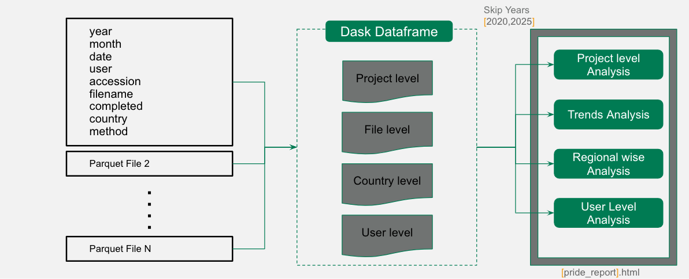

## **Workflow**

### 1. Copy Data 
   If you are running the pipeline in EBI infrastructure, the pipeline will copy data from the original log file location to your path
   Currently, original log files are stored in a place where only `datamover` can be read. So, as the first step, our pipeline will copy(`rsync`) the log files to the location you specified which can be accessed by the `standard` queue.
    Once this job is completed, it will automatically launched the next dependant job to process the log files and do the statistical analysis.

!!! note "Running first time"

    It could take 2-3 hours to copy the log files for the first time, then it is will be few minutes for the subsequent runs.

### 2. Process Log Files

   This step will collect the names of log files, process the log files parallel and apply many filters excluding the unwanted data. 
   The processed log files will be stored in the Parquet format which is a columnar storage format that is optimized for reading and writing large datasets.

### 3. Produce Statistics Report
   Using dask framework, parquet will be queried and the statistics will be generated.
   This step will generate the statistics report in the HTML format and will be stored in the location you specified.

Detailed workflow steps can be found in the [workflow documentation](../../misc/workflow).